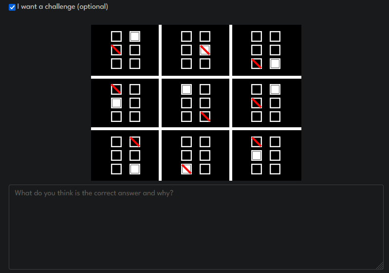
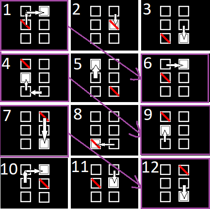

# AE Studio's challenge

An attempt to draw and solve the challenge provided from [AE Studio](https://ae.studio/):



## Skip straight to my answer

[here](#my-answer)

## About the question

It is **very vauge**, I am left questioning how trivial of an answer might be expected:

- is it a True/False answer?
- is the expected answer the 10th set of tiles if the given 3x3 grid is actually an ordered set from 1 to 9?
- or perhaps the 4th, row, or column?
- or somethign else?

## Observations

We are given a 3x3 grid of boards, within each board, a 3x2 set of tiles.

On each Board, the tiles are blank by default

- However, 1 tile must be Filled, and 1 tile must be Slashed.
- The same tile can be both Filled and Slashed, and it satisfies the criteria.
- There cannot be more than 1 tile nor more than 1 slash on the same board.
- Board arrangements can repeat but seems inconsistent
- Typed-tile positions can repeat but seems inconsistent

## Deeper observations 

### Non-linear / inconsistent translations

Running an assumption that we have a grid-of-boards arrangened as

``` md
 1 | 2 | 3
 --------
 4 | 5 | 6
 ---------
 7 | 8 | 9
```

Immediately we can see that boards (1, 6) and (4, 9) are identical.

If this translation held true in a 1-D ordering regardless of whether it's a transposed grid or not, we should expect (2,7), (3,8) to also be equal, but they're NOT. This observation also applies to the transposed grid.

Thus:
> The translation is not linear/equal

With some modulo arithmatic:

``` md
ASSUMED: 
- Modulo arithmatic / cyclic. +2 is the same as -4 (6 modulo)
- Board 9 goes back to board 1
- Boards and Tiles translate in increments given by their ordering
```

If we order the tiles on the board such that it's:

``` md
 1 | 2 
 -----
 3 | 4 
 -----
 5 | 6 
```

#### Horizontal sequential tile-order

Then the translation values for each tile going to the next board is obtainable as:

``` md
TILE ORDER
 1 | 2 
 -----
 3 | 4 
 -----
 5 | 6 

White Fill:
  + 2 | + 2 | + 3
 ----------------
  + 4 | + 1 | + 4
 ----------------
  + 5 | + 4 | + 5

Slashes:
  + 1 | + 1 | + 2
 ----------------
  + 5 | + 3 | + 5
 ----------------
  + 3 | + 2 | + 2 (<- if this was +3, we'd see a correlation with the White Fill, but it's not)
```

This isn't very consistent.
The same can be done with a transposed board order but we get similar results:

#### Vertical sequential tile-order

``` md
TILE ORDER
 1 | 4 
 -----
 2 | 5 
 -----
 3 | 6 

White Fill:
  + 1 | + 1 | + 2
 ----------------
  + 5 | + 3 | + 2
 ----------------
  + 3 | + 5 | + 2

Slashes:
  + 3 | + 4 | + 4
 ----------------
  + 5 | + 2 | + 2
 ----------------
  + 5 | + 4 | + 1 
```

Again, pretty inconsistent. There doesn't seem to be any fibbonacci like sequences going on at a glimpse, so I doubt the translation uses more than 1 state prior.

If there was something based on the position on the grid instead of the 1 to 9 ordering instead, eg row and col values, it's not obvious to me either.

I tried to sequence the boards on the grid differently too to no avail.

### Another tile ordering?

So I kinda looked around a lil and found some ideas from a stackexchange [thread](https://puzzling.stackexchange.com/questions/118865/how-do-i-solve-this-black-and-white-square-box-puzzle-it-features-3-rows-and-3).

Someone did a different tile order such that it's more cyclic in the spatial sense:

#### Cyclic Clockwise tile-order

``` md
TILE ORDER
 6 | 1 
 -----
 5 | 2 
 -----
 4 | 3 

White Fill:
  + 1 | + 1 | + 2
 ----------------
  + 1 | + 1 | + 2
 ----------------
  + 1 | + 1 | + 2

Slashes:
  + 3 | + 2 | + 2
 ----------------
  + 3 | + 2 | + 2
 ----------------
  + 3 | + 2 | + 5 (<- WE WERE SO CLOSE TO 3,2,2) 
```

BUT! We can disregard the final translation value since it's assumed to loop back to the first. What if it's not, but there is a hidden 10th translated board???
We see a pattern then:

- WhiteFill: (1, 1, 2)
- Slashes: (3, 2, 2)

### Static positions

Again, inspiration taken and credit where its [due (same SE thread)](https://puzzling.stackexchange.com/questions/118865/how-do-i-solve-this-black-and-white-square-box-puzzle-it-features-3-rows-and-3):

Using a sequential tile order (not cyclic), and noting their positions (generally the first thing to do in sequence solving, then take deltas):

``` md
TILE ORDER
 1 | 2 
 -----
 3 | 4 
 -----
 5 | 6 

White Fill:
  2 | 4 | 6
 -----------
  3 | 1 | 2
 -----------
  6 | 5 | 3

Slashes:
  3 | 4 | 5
 -----------
  1 | 6 | 3
 -----------
  2 | 5 | 1
```

We have solved the deltas already [above](#horizontal-sequential-tile-order) actually, but pretend there is a 10th board we can't see thus no delta for the last one:

``` md
White Fill Deltas:
  + 2 | + 2 | + 3
 ----------------
  + 4 | + 1 | + 4
 ----------------
  + 5 | + 4 | + ?

Slashes Deltas:
  + 1 | + 1 | + 2
 ----------------
  + 5 | + 3 | + 5
 ----------------
  + 3 | + 2 | + ?
```

Can you see a pattern here?
Let's play around.

``` md
White Fill Deltas altered:
  + 1 | + 1 | + 2 (-1)
 ----------------
  + 4 | + 1 | + 4 (no change)
 ----------------
  + 3 | + 2 | + ? (-2)

Slashes Deltas altered:
  + 1 | + 1 | + 2 (no change)
 ----------------
  + 4 | + 2 | + 4 (-1)
 ----------------
  + 3 | + 2 | + ? (no change)

Then:
White altered Deltas / Slashes altered deltas:
  1 | 1 | 1
 -----------
  1 | 2 | 1
 -----------
  1 | 1 | N/A 

  There's some primitive calculus trickery here but not gonna try proving it 
  (because it's very makeshift and silly that I can't really explain my steps in clarity without significant effort).
```

TBH doesnt say much besides it's non-linear but there may be a modulo_5 or higher cycle in there.

Results above suggest it's modulo 5 thanks to boards (1,6) and (4,9) being the same,

and the last delta in the [circle order](#cyclic-clockwise-tile-order) having a +5 instead of a +2 meaning there is a hidden 10th board onwards. For 9 elements to alias with 5-cyclic, the next alias is at board 45 (where board 46 is the same as board 1)

``` md
  + 3 | + 2 | + 5 (<- WE WERE SO CLOSE TO 3,2,2 ) 
```

If this was truly the case though, why arrange in a 3x3 grid rather than a 1x9 array?

## My answer

- Translations are not linear, ie different on each hop
- But they have a possible 5-modulo pattern overall
- And a 3-modulo cycle using a [cycic tile order](#cyclic-clockwise-tile-order)
  - WhiteFill: (1, 1, 2)
  - Slashes: (3, 2, 2)

If it was a 5-modulo pattern, then board 12 should be the same as board 7

Let's try to use the 3-mod cycles to generate the last row (boards 10,11,12)



There. It works, Boards 7 and 12 are the same, and board 12 was gnerated with the rule found above.
