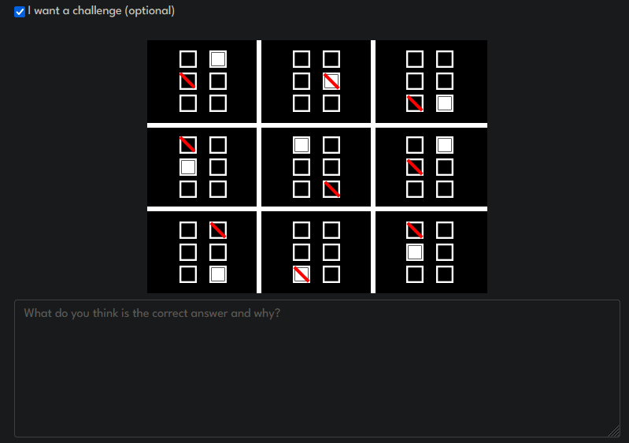
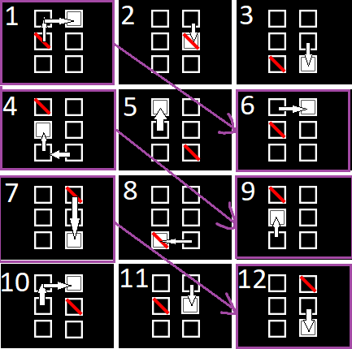
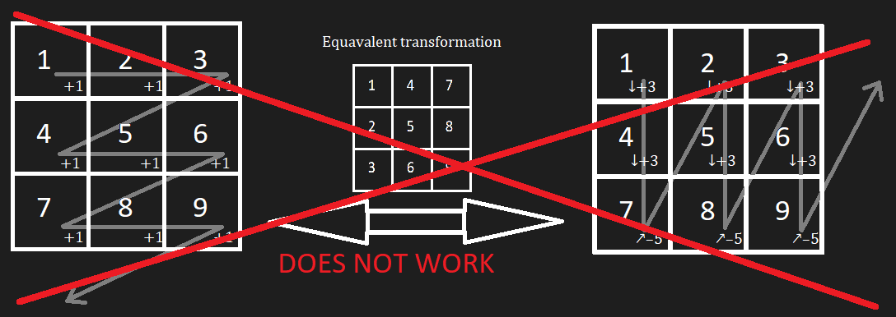
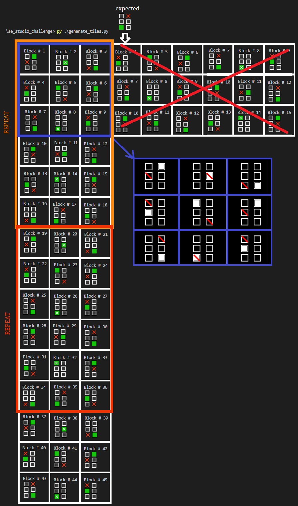
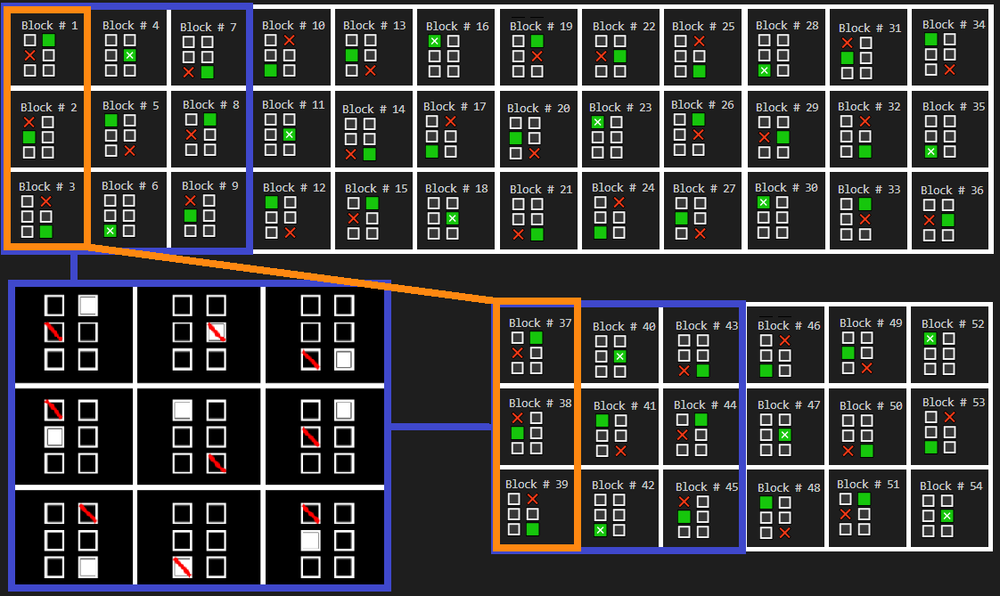

# AE Studio's challenge

An attempt to draw and solve the challenge provided from [AE Studio](https://ae.studio/):



## Skip straight to my answer

[here](#my-answer)

## About the question

It is **very vauge**, I am left questioning how trivial of an answer might be expected:

- is it a True/False answer?
- is the expected answer the 10th set of tiles if the given 3x3 grid is actually an ordered set from 1 to 9?
- or perhaps the 4th, row, or column?
- or somethign else?

## Observations

We are given a 3x3 grid of blocks, within each block, a 3x2 set of tiles.

On each block, the tiles are blank by default

- However, 1 tile must be Filled, and 1 tile must be Slashed.
- The same tile can be both Filled and Slashed, and it satisfies the criteria.
- There cannot be more than 1 tile nor more than 1 slash on the same block.
- Block arrangements can repeat but seems inconsistent
- Typed-tile positions can repeat but seems inconsistent

## Deeper observations & thought process

### Non-linear / inconsistent translations

Running an assumption that we have a grid-of-blocks arrangened as

``` md
 1 | 2 | 3
 --------
 4 | 5 | 6
 ---------
 7 | 8 | 9
```

Immediately we can see that blocks (1, 6) and (4, 9) are identical.

If this translation held true in a 1-D ordering regardless of whether it's a transposed grid or not, we should expect (2,7), (3,8) to also be equal, but they're NOT. This observation also applies to the transposed grid.

Thus:
> The translation is not linear/equal

With some modulo arithmatic:

``` md
ASSUMED: 
- Modulo arithmatic / cyclic. +2 is the same as -4 (6 modulo)
- Block 9 goes back to block 1
- Blocks and Tiles translate in increments given by their ordering
```

If we order the tiles on the block such that it's:

``` md
 1 | 2 
 -----
 3 | 4 
 -----
 5 | 6 
```

#### Horizontal sequential tile-order

Then the translation values for each tile going to the next block is obtainable as:

``` md
TILE ORDER
 1 | 2 
 -----
 3 | 4 
 -----
 5 | 6 

White Fill:
  + 2 | + 2 | + 3
 ----------------
  + 4 | + 1 | + 4
 ----------------
  + 5 | + 4 | + 5

Slashes:
  + 1 | + 1 | + 2
 ----------------
  + 5 | + 3 | + 5
 ----------------
  + 3 | + 2 | + 2 (<- if this was +3, we'd see a correlation with the White Fill, but it's not)
```

This isn't very consistent.
The same can be done with a transposed block order but we get similar results:

#### Vertical sequential tile-order

``` md
TILE ORDER
 1 | 4 
 -----
 2 | 5 
 -----
 3 | 6 

White Fill:
  + 1 | + 1 | + 2
 ----------------
  + 5 | + 3 | + 2
 ----------------
  + 3 | + 5 | + 2

Slashes:
  + 3 | + 4 | + 4
 ----------------
  + 5 | + 2 | + 2
 ----------------
  + 5 | + 4 | + 1 
```

Again, pretty inconsistent. There doesn't seem to be any fibbonacci like sequences going on at a glimpse, so I doubt the translation uses more than 1 state prior.

If there was something based on the position on the grid instead of the 1 to 9 ordering instead, eg row and col values, it's not obvious to me either.

I tried to sequence the blocks on the grid differently too to no avail.

### Another tile ordering?

So I kinda looked around a lil and found some ideas from a stackexchange [thread](https://puzzling.stackexchange.com/questions/118865/how-do-i-solve-this-black-and-white-square-box-puzzle-it-features-3-rows-and-3).

Someone did a different tile order such that it's more cyclic in the spatial sense:

#### Cyclic Clockwise tile-order

``` md
TILE ORDER
 6 | 1 
 -----
 5 | 2 
 -----
 4 | 3 

White Fill:
  + 1 | + 1 | + 2
 ----------------
  + 1 | + 1 | + 2
 ----------------
  + 1 | + 1 | + 2

Slashes:
  + 3 | + 2 | + 2
 ----------------
  + 3 | + 2 | + 2
 ----------------
  + 3 | + 2 | + 5 (<- WE WERE SO CLOSE TO 3,2,2) 
```

BUT! We can disregard the final translation value since it's assumed to loop back to the first. What if it's not, but there is a hidden 10th translated block???
We see a pattern then:

- WhiteFill: (1, 1, 2)
- Slashes: (3, 2, 2)

### Static positions

Again, inspiration taken and credit where its [due (same SE thread)](https://puzzling.stackexchange.com/questions/118865/how-do-i-solve-this-black-and-white-square-box-puzzle-it-features-3-rows-and-3):

Using a sequential tile order (not cyclic), and noting their positions (generally the first thing to do in sequence solving, then take deltas):

``` md
TILE ORDER
 1 | 2 
 -----
 3 | 4 
 -----
 5 | 6 

White Fill:
  2 | 4 | 6
 -----------
  3 | 1 | 2
 -----------
  6 | 5 | 3

Slashes:
  3 | 4 | 5
 -----------
  1 | 6 | 3
 -----------
  2 | 5 | 1
```

We have solved the deltas already [above](#horizontal-sequential-tile-order) actually, but pretend there is a 10th block we can't see thus no delta for the last one:

``` md
White Fill Deltas:
  + 2 | + 2 | + 3
 ----------------
  + 4 | + 1 | + 4
 ----------------
  + 5 | + 4 | + ?

Slashes Deltas:
  + 1 | + 1 | + 2
 ----------------
  + 5 | + 3 | + 5
 ----------------
  + 3 | + 2 | + ?
```

Can you see a pattern here?
Let's play around.

``` md
White Fill Deltas altered:
  + 1 | + 1 | + 2 (-1)
 ----------------
  + 4 | + 1 | + 4 (no change)
 ----------------
  + 3 | + 2 | + ? (-2)

Slashes Deltas altered:
  + 1 | + 1 | + 2 (no change)
 ----------------
  + 4 | + 2 | + 4 (-1)
 ----------------
  + 3 | + 2 | + ? (no change)

Then:
White altered Deltas / Slashes altered deltas:
  1 | 1 | 1
 -----------
  1 | 2 | 1
 -----------
  1 | 1 | N/A 

  There's some primitive calculus trickery here but not gonna try proving it 
  (because it's very makeshift and silly that I can't really explain my steps in clarity without significant effort).
```

TBH doesnt say much besides it's non-linear but there may be a modulo_5 or higher cycle in there.

Results above suggest it's modulo 5 thanks to blocks (1,6) and (4,9) being the same,

and the last delta in the [circle order](#cyclic-clockwise-tile-order) having a +5 instead of a +2 meaning there is a hidden 10th block onwards. For 9 elements to alias with 5-cyclic, the next alias is at block 45 (where block 46 is the same as block 1)

``` md
  + 3 | + 2 | + 5 (<- WE WERE SO CLOSE TO 3,2,2 ) 
```

If this was truly the case though, why arrange in a 3x3 grid rather than a 1x9 array?

## My answer

We shall use the following tile order:

``` md
TILE ORDER
 5 | 0 
 -----
 4 | 1 
 -----
 3 | 2 
```

I also wrote a py script to assist me with generating more blocks of tiles.

### Initial answer

We note that:

- Translations are not linear, ie different on each hop
- But they have a possible 5-modulo pattern overall (as in Block-1 repeats at Block-6, 2 at 7, etc)
- And a 3-modulo cycle using a [cycic tile order](#cyclic-clockwise-tile-order)

Given the following grid order, we obtain:

``` md
downwards:
  1  | 2  | 3 
 -------------
  4  | 5  | 6 
 -------------
  7  | 8  | 9 
 -------------
  10 | 11 | 12

 WhiteFill: (1, 1, 2)
 Slashes: (3, 2, 2)
```



There. It works, blocks 7 and 12 are the same, and block/block 12 was gnerated with the rule found above.

### Further consideration

Our downwards rule is:

- WhiteFill: (1, 1, 2)
- Slashes: (3, 2, 2)

We can also figure out a sideways rule:

``` md
sideways:
 1 | 4 | 7 | 10
 ---------------
 2 | 5 | 8 | 11
 ---------------
 3 | 6 | 9 | 12

 WhiteFill: (4, 4, 5) equivalent to (-2, -2, -1)
 Slashes: (1, 1, 1, 1, 1, 0)
```

I attempted to "cheat" by saying the transformation from downwards to sideways is the same as repeating the transform as follows by stepping the blocks (+3, +3, -5):



### Downwards result and analysis

WhiteFill: (1, 1, 2)
Slashes: (3, 2, 2)
  
Here it is:



Note the repeats at every +18th block. ( I initially thought 45 was the magic number, but I made a mistake )

#### Here's why:

Considering 6 possible tile positions, any +6 tile movement is a repeat.

- Each WhiteFill cycle has a `1+1+2 -> 4 tilestep/cycle` so every 3 cycles leads to 12 tile-steps, which is back to the original spot. ie `12 % 6 = 0`. We can figure out that it's 3 cycles by: `LCM(4,6) = 12` and thus `(12 tilestep) / (4 tilestep/cycle) = 3 cycle`.
- Similarly, Slashes cycle `3+2+2 -> 7 tilestep/cycle == 1 tilestep/cycle in mod_6`. So, trivially every 6th cycle makes 6 tile-steps. ie. Repeats every 6th.
- Both of them have 3 operations in a cycle, which correspond to 3 movements in the grid, thus `1 cycle = 1 row = 3 block-steps`.
- WhiteFill: 3 cycles. Slashes: 6 cycles. `LCM(3,6) = 6 -> 6 cycles == 18 block-steps`

> Thus, every +18 block-steps or every +6 row is a repeat

### Sideways result

WhiteFill: (4, 4, 5) equivalent to (-2, -2, -1)
Slashes: (1, 1, 1, 1, 1, 0)



Using the same analysis:

- WhiteFill: `4+4+5 = 13 -> 1 tilestep / whitefill_cycle (3 blocksteps)` which means 6 cycles or 18 blocksteps
- Slashes: `1+1+1+1+1+0 = 5 -> 5 tilestep / slashes_cycle (6 blocksteps)` which means 6 cycles since `LCM(5,6) = 30`. This works out to be every `6 cycle * 6 blocksteps/cycle = 36 blocksteps`
- Whitefill: 18 blocksteps, Slashes: 36 blocksteps. `LCM(18, 36) = 36`

> Therefore repeats occur at every +36 block-steps

### Final notes?

Yeah this is pretty much it. I have spent too much time on this.

I don't think this answer is objective, but it is merely up to interpretation. What I mean by this is that I could've easily said that my ['cheat'](#further-consideration) works and not choose the sideways rule as the superior basis to cancel it.

There are many rules that could be used to extend the block. One super trivial one would be to say something like:

Example lame rule:

- On each block, the tiles are blank by default
- However, 1 tile must be Filled, and 1 tile must be Slashed.
- The same tile can be both Filled and Slashed, and it satisfies the criteria.
- There cannot be more than 1 filled nor more than 1 slashed on the same block.
- Repeats can occur.
- There are no patterns to be had. Any further grids of blocks, or blocks that satisfies the above criteria are valid.

What it means is that you can have any RANDOM block that doesnt have more than 1 slash nor fill and it satisfies it.

This is a trivial answer but it still checks out.

So... why was the [challenge](#ae-studios-challenge) so insanely vague to begin with?
